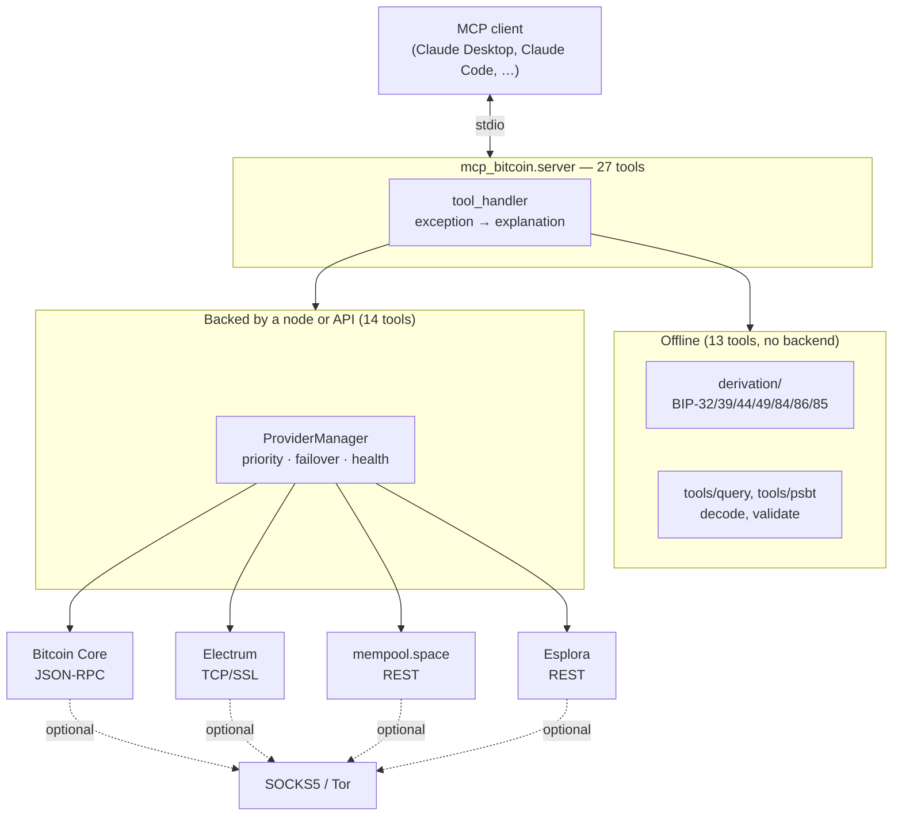

# mcp-bitcoin — Design

Describes what the code does as of v0.1.0. Planned work lives in
[ROADMAP.md](ROADMAP.md); this document does not describe intentions.

## Overview

`mcp-bitcoin` is a Python MCP server providing read-only Bitcoin access: HD
wallet derivation (BIP-32/39/44/49/84/86/85), address and UTXO queries,
transaction and block lookup, fee estimation and mempool analysis. It routes
requests across four interchangeable backends with priority failover, supports
all four networks, and can run entirely over Tor.

It cannot build, sign or broadcast transactions. See
[ROADMAP.md](ROADMAP.md) for why.

---

## 1. Shape of the system



---

## 2. Backend abstraction

All backends implement the `BitcoinProvider` protocol
(`providers/base.py`). No backend implements every method — Bitcoin Core has no
address index, Electrum serves no block data — so a backend that genuinely
cannot answer raises `NotImplementedError`.

That distinction is load-bearing. `ProviderManager.call` sorts outcomes into
three buckets:

| Outcome | Meaning | Reported as |
|---|---|---|
| `NotImplementedError` | backend doesn't do this | "does not support this operation" |
| Exception / timeout | backend failed | per-backend error detail |
| In backoff | recently failed, cooling down | "still in failure backoff" |

Collapsing "unsupported" into "failed" is what previously produced an empty
error message for the documented Core-only and Electrum-only configurations.

`NetworkMismatchError` is deliberately *not* failed over. A backend serving the
wrong chain is an operator misconfiguration, and silently falling through to
another backend would mask it.

### Health tracking

A failed call marks the backend degraded and starts an exponential backoff
(60s → 120s → … capped at 900s). The counter advances **once per outage**, not
once per failed request — otherwise a handful of calls during a brief node
restart jumps straight to the 15-minute cap.

`ping_all(probe_only=True)` is the default for the `ping` and `list_backends`
tools, so asking for status never mutates health state.

### Shared REST implementation

mempool.space is a fork of Blockstream's Esplora and serves the same core API,
so `providers/rest.py` implements it once as `EsploraFamilyProvider`.
`MempoolProvider` overrides only the fee and mempool endpoints, where
mempool.space's `/v1/` namespace is richer.

### Tor

When `MCP_BITCOIN_TOR_PROXY` is set, every backend connection is constructed
with a SOCKS5 connector — HTTP through `aiohttp_socks`, Electrum's raw socket
through `python_socks`. There is no clearnet fallback path.

`socks5h://` is accepted and rewritten to `socks5://`: it is what Tor
documentation universally shows, but `python_socks` rejects it outright.
Remote DNS is preserved because `python_socks` defaults to it for SOCKS5.

Startup probes the proxy with a TCP connect and exits non-zero if it is
unreachable — this is what makes "fail-closed" true rather than aspirational.

---

## 3. Derivation

```
derivation/
├── mnemonic.py    BIP-39: generate, validate, seed
├── hd.py          BIP-32: path parsing, derivation, xpub serialization
├── standards.py   BIP-44/49/84/86 path building and address ranges
├── bip85.py       BIP-85 deterministic child entropy
├── addresses.py   public key → P2PKH / P2SH-P2WPKH / P2WPKH / P2TR
└── wif.py         WIF decoding
```

**Network parameters come from `Network.embit_network`**, which maps all four
networks onto embit's table. The obvious shortcut — branching on
`is_mainnet` — silently gives regtest testnet's `tb1` prefix instead of
`bcrt1`.

**Paths are validated before use.** `parse_derivation_path` enforces a strict
grammar and rejects indices ≥ 2³¹; `derive_key` calls it rather than passing
user input to embit directly.

**Mnemonics are validated before use.** `mnemonic_to_seed` runs the checksum
itself rather than relying on embit doing so internally as a side effect.

**BIP-85 path shapes differ per application**, and the number of bytes
requested is part of the HEX path, not a truncation parameter:

```
BIP-39 child:  m/83696968'/39'/{language}'/{words}'/{index}'
HEX entropy:   m/83696968'/128169'/{num_bytes}'/{index}'
```

---

## 4. Security model

Covered fully in [SECURITY.md](SECURITY.md). The design consequences:

**Watch-only by default.** Tools accepting a seed phrase or private key check
`config.allow_mnemonic` and refuse with a message that names the xpub
alternative. The xpub path requires no permission and covers every query.

**No secret is ever returned.** `decode_wif` and `derive_from_path` report
public keys and addresses only. Returning the private key would double its
exposure while telling the caller nothing new.

**No zeroization.** Python `bytes` are immutable and the collector may copy
them, so wiping key material is not achievable in this process. Earlier
revisions of this document claimed otherwise; the claim was false and is not
restated here. The mitigation is refusing secrets, not scrubbing them.

**Addresses are network-checked before any query.** Electrum indexes by
`sha256(scriptPubKey)`, which is identical across networks for the same pubkey
hash — so a cross-network lookup returns a *plausible wrong answer* rather than
an error. `utils/validation.py` is the single chokepoint.

**TLS is verified by default**, defeatable explicitly for self-signed Electrum
servers, and skipped for `.onion` hosts where the address authenticates the
endpoint.

---

## 5. Error handling

Every tool is wrapped in `tool_handler`, which converts exceptions into
structured, actionable output rather than a traceback:

| Exception | Surfaces as |
|---|---|
| `SecretsNotAllowedError` | `secrets_not_allowed`, with the xpub alternative |
| `NetworkMismatchError` | `network_mismatch`, naming both chains |
| `BackendUnavailableError` | `backend_unavailable`, per-backend detail |
| `ValueError` | `invalid_input` |
| anything else | `internal_error`, logged with a traceback |

Results are rendered twice over: a one-line human summary, then the structured
JSON payload.

---

## 6. Configuration

Environment variables only; see the table in [README.md](README.md). Loading is
tolerant of empty strings, because an unset key in an MCP client's JSON config
arrives as `""` and should mean "default", not "crash".

---

## 7. Testing

The suite asserts against **published specification vectors**, not against this
implementation's own output. `tests/vectors.py` collects them with their source
BIPs.

This is the central lesson of the project. An earlier revision had 81 passing
tests while shipping a BIP-85 function whose output no other wallet would
reproduce, because the tests only checked determinism and well-formedness —
properties a wrong implementation satisfies perfectly.

| Area | Approach |
|---|---|
| Derivation | BIP-44/49/84/86 and BIP-85 published vectors, all four networks |
| Validation | Cross-network rejection for every address type |
| Providers | Scripted fakes for failover; frame-level tests for Electrum |
| Sanitization | Mnemonics and WIF keys redacted; txids left readable |
| Server | Tool registration, error translation, Tor preflight |

The suite is fully offline, so CI never depends on a public API being up.

---

## 8. Dependencies

| Package | Why |
|---|---|
| `mcp` | Official MCP SDK (2.x) |
| `embit` | Pure-Python Bitcoin primitives — no compilation, works on a Raspberry Pi |
| `aiohttp` + `aiohttp-socks` | Async HTTP, with SOCKS5 for Tor |
| `python-socks` | SOCKS5 for Electrum's raw socket |
| `pydantic` | Config parsing and response models |

`embit` ships no type stubs, so its returns arrive as `Any` and are coerced at
the call boundary to keep `mypy --strict` meaningful.
